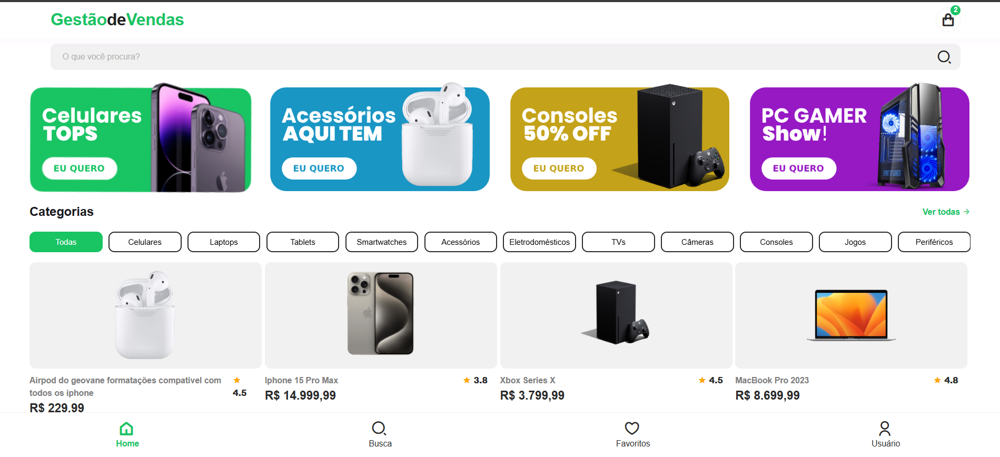

# App de Gestão de Vendas

Este é um aplicativo de **gestão de vendas**, desenvolvido por **Geovane Formatações** com base na [videoaula](https://www.youtube.com/watch?v=JG2lcJeQuO8). O app foi criado utilizando **Visual Studio** e **Apache Cordova**, com as tecnologias **HTML, CSS e JavaScript**.

## Funcionalidades

- **Tela Home**
  - Exibe um **banner**
  - Lista as **categorias de produtos**
  - Apresenta os **produtos disponíveis**
  
- **Tela de Detalhes do Produto**
  - Exibe todas as informações sobre o produto
  - Possui um botão para **adicionar ao carrinho**
  
## Tecnologias Utilizadas

- **Apache Cordova**
- **HTML5**
- **CSS3**
- **JavaScript**
- **Visual Studio**

## Como Executar o Projeto

1. Instale o [Visual Studio](https://visualstudio.microsoft.com/)
2. Instale o **Apache Cordova** no Visual Studio
3. Clone ou baixe este repositório
4. Abra o projeto no Visual Studio
5. Execute o aplicativo em um emulador ou dispositivo físico

## Autor

Desenvolvido por **Geovane Formatações**

## Referência

[Assista à videoaula](https://www.youtube.com/watch?v=JG2lcJeQuO8) para mais detalhes sobre o desenvolvimento do app.

